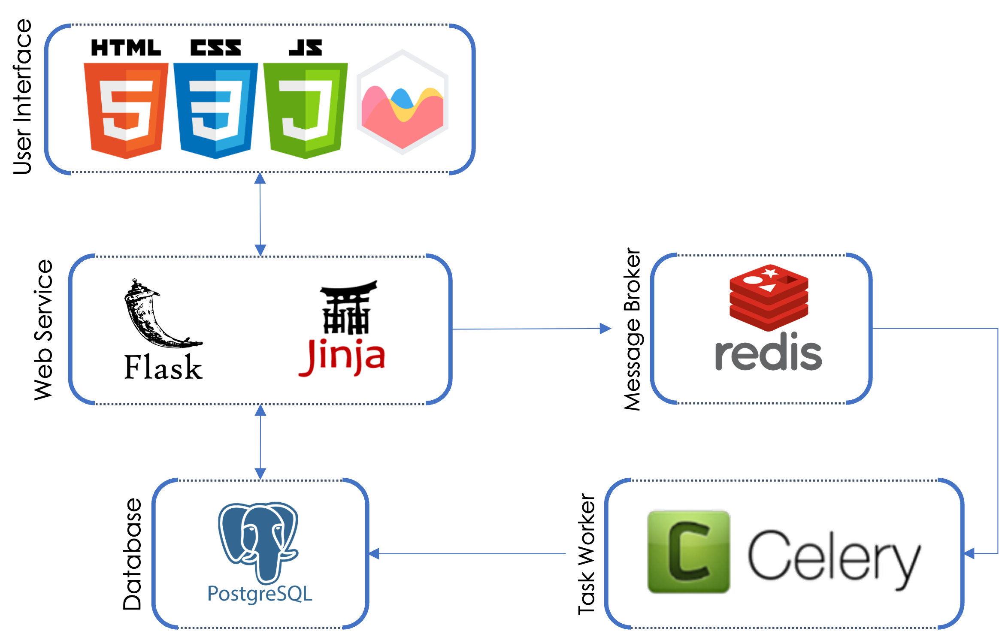

# Welcome to my code space

Here you will find a plethora of re-usable code for the following areas:

1. Webapps
2. Data Analysis
3. [Machine Learning]([(/machine-learning))
4. Data Catalog (DataHub) Custom Code

Below you will find some samples of the outputs as some of my code base is private.

## Data Profiling Web Application

|Icon | Purpose|
---| ---|
|</img> | Jumpstart is a light-weight web application that will help you perform basic tabular data profiling to highlight general statistics about your uploaded data. You simplay upload a file to be analysed, and start visualizing the results. You also have the ability to see the status of the most recent previous analyses that you have submitted, in which you can perform job management.|

<b>Functionality</b>

1. Ability to login using username and password.
1. UI Dark Mode
1. Automated Exploratory Analysis
    - Table level statistics
    - Table variable types
    - Table variable statistics
    - Table alert types 
    - Variable level statistics table
1. Save job data and results to a database
1. Visualize the results in an interactive dashboard format
1. Data Labels for Privacy Apllication 
1. UI Dark Mode
1. Job Management 

<b>Future Functionality</b>

1. API endpoints for profiling
1. Great Expectation execution
1. UI for expectation management

<b>Architecture</b>

</img>

<b>Screenshots</b>

